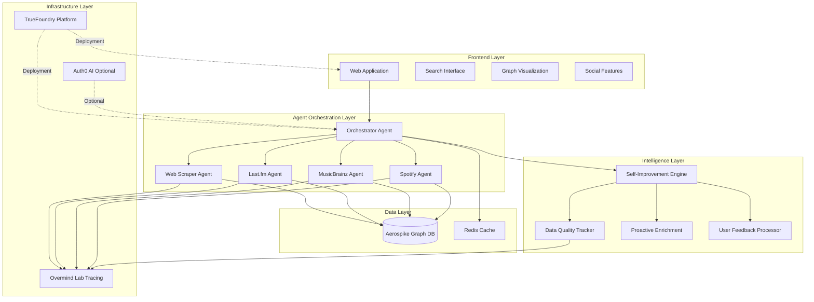
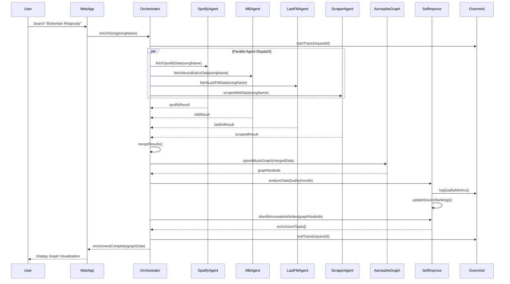

# Design Document: MusicMind Agent Platform

## Overview

MusicMind is an autonomous AI agent platform designed for the "Authorized to Act" hackathon that demonstrates self-improving multi-agent orchestration. The system takes a song name as input and dispatches specialized sub-agents to gather comprehensive music data from multiple sources (Last.fm, MusicBrainz, Spotify, web scraping). Data is organized into an Aerospike graph database with rich entity relationships (songs, artists, albums, labels, instruments, venues, concerts). The platform features a social web application for exploring music connections through graph visualization, and critically implements self-improvement through learning from data quality metrics, proactive enrichment of incomplete nodes, and user feedback signals. This design prioritizes the hackathon's core evaluation criteria: autonomous agent behavior, self-improvement capabilities, and practical demonstration value within a 48-hour solo development timeline.

## Architecture




## Main Workflow: Song Data Enrichment




## Components and Interfaces

### Component 1: Orchestrator Agent

**Purpose**: Central brain that coordinates all sub-agents, manages task distribution, merges results, and triggers self-improvement cycles.

**Interface**:
```pascal
INTERFACE OrchestratorAgent
  PROCEDURE enrichSong(songName: String): EnrichmentResult
  PROCEDURE dispatchAgents(songName: String, agentList: List<Agent>): List<AgentResult>
  PROCEDURE mergeResults(results: List<AgentResult>): MergedMusicData
  PROCEDURE triggerSelfImprovement(results: List<AgentResult>, graphNodeIds: List<UUID>): Void
  PROCEDURE getEnrichmentStatus(requestId: UUID): EnrichmentStatus
END INTERFACE
```

**Responsibilities**:
- Receive song enrichment requests from web frontend
- Dispatch parallel tasks to specialized sub-agents
- Merge and deduplicate data from multiple sources
- Coordinate with Aerospike Graph for data persistence
- Trigger self-improvement analysis after each enrichment cycle
- Manage request tracing via Overmind Lab
- Handle agent failures and implement retry logic

### Component 2: Spotify Agent

**Purpose**: Fetch song, artist, album, and audio feature data from Spotify Web API.

**Interface**:
```pascal
INTERFACE SpotifyAgent
  PROCEDURE fetchSpotifyData(songName: String): SpotifyResult
  PROCEDURE searchTrack(query: String): List<Track>
  PROCEDURE getArtistDetails(artistId: String): Artist
  PROCEDURE getAlbumDetails(albumId: String): Album
  PROCEDURE getAudioFeatures(trackId: String): AudioFeatures
END INTERFACE
```

**Responsibilities**:
- Authenticate with Spotify API using OAuth2 client credentials
- Search for tracks matching song name
- Retrieve detailed artist information (genres, popularity, related artists)
- Fetch album metadata and track listings
- Extract audio features (tempo, key, energy, danceability)
- Handle rate limiting and API errors gracefully
- Log all API calls to Overmind Lab for quality tracking

### Component 3: MusicBrainz Agent

**Purpose**: Fetch authoritative music metadata including recording details, artist relationships, and label information.

**Interface**:
```pascal
INTERFACE MusicBrainzAgent
  PROCEDURE fetchMusicBrainzData(songName: String): MusicBrainzResult
  PROCEDURE searchRecording(query: String): List<Recording>
  PROCEDURE getRecordingDetails(recordingId: UUID): RecordingDetails
  PROCEDURE getArtistRelationships(artistId: UUID): List<Relationship>
  PROCEDURE getLabelInfo(labelId: UUID): RecordLabel
END INTERFACE
```

**Responsibilities**:
- Query MusicBrainz database for recording metadata
- Retrieve artist-artist relationships (member of, collaboration)
- Fetch record label information and contracts
- Extract instrument credits and performer details
- Map MusicBrainz IDs to other service identifiers
- Respect MusicBrainz rate limits (1 request/second)
- Provide high-quality canonical music data


### Component 4: Last.fm Agent

**Purpose**: Fetch social music data including tags, similar tracks, listener statistics, and user-generated content.

**Interface**:
```pascal
INTERFACE LastFMAgent
  PROCEDURE fetchLastFMData(songName: String): LastFMResult
  PROCEDURE searchTrack(query: String): List<Track>
  PROCEDURE getTrackInfo(artist: String, track: String): TrackInfo
  PROCEDURE getSimilarTracks(artist: String, track: String): List<SimilarTrack>
  PROCEDURE getTopTags(artist: String, track: String): List<Tag>
END INTERFACE
```

**Responsibilities**:
- Query Last.fm API for track information
- Retrieve user-generated tags and folksonomy data
- Fetch similar tracks based on collaborative filtering
- Extract listener counts and play statistics
- Provide social context and music discovery data
- Handle API authentication and rate limits
- Contribute to graph enrichment with social signals

### Component 5: Web Scraper Agent

**Purpose**: Extract supplementary music data from web sources not available via APIs (concert venues, setlists, reviews).

**Interface**:
```pascal
INTERFACE WebScraperAgent
  PROCEDURE scrapeWebData(songName: String): ScrapedResult
  PROCEDURE scrapeConcertData(artistName: String): List<Concert>
  PROCEDURE scrapeVenueInfo(venueName: String): Venue
  PROCEDURE scrapeSetlists(artistName: String): List<Setlist>
  PROCEDURE extractStructuredData(html: String): StructuredData
END INTERFACE
```

**Responsibilities**:
- Scrape concert and venue information from setlist.fm or similar sites
- Extract structured data using CSS selectors and XPath
- Parse dates, locations, and performer information
- Respect robots.txt and implement polite crawling delays
- Handle dynamic JavaScript-rendered content if needed
- Validate and clean scraped data before storage
- Provide fallback data when APIs are unavailable

### Component 6: Self-Improvement Engine

**Purpose**: Implement autonomous learning by tracking data quality, proactively enriching incomplete nodes, and incorporating user feedback.

**Interface**:
```pascal
INTERFACE SelfImprovementEngine
  PROCEDURE analyzeDataQuality(results: List<AgentResult>): QualityMetrics
  PROCEDURE updateSourceRankings(metrics: QualityMetrics): Void
  PROCEDURE identifyIncompleteNodes(graphNodeIds: List<UUID>): List<EnrichmentTask>
  PROCEDURE scheduleProactiveEnrichment(tasks: List<EnrichmentTask>): Void
  PROCEDURE processUserFeedback(feedback: UserFeedback): Void
  PROCEDURE getSourceQualityReport(): SourceQualityReport
END INTERFACE
```

**Responsibilities**:
- Track completeness, accuracy, and freshness of data from each source
- Maintain dynamic rankings of data source quality per entity type
- Identify graph nodes with missing or incomplete attributes
- Schedule background enrichment tasks for incomplete nodes
- Process user feedback signals (likes, dislikes, corrections)
- Adjust agent priorities based on learned quality metrics
- Log all learning events to Overmind Lab for demonstration
- Demonstrate measurable improvement over time


### Component 7: Aerospike Graph Database

**Purpose**: Store and query music entities and relationships as a property graph with high performance and scalability.

**Interface**:
```pascal
INTERFACE AerospikeGraphDB
  PROCEDURE upsertNode(nodeType: String, properties: Map<String, Any>): UUID
  PROCEDURE upsertEdge(fromNodeId: UUID, toNodeId: UUID, edgeType: String, properties: Map<String, Any>): UUID
  PROCEDURE queryNeighbors(nodeId: UUID, edgeType: String, depth: Integer): List<Node>
  PROCEDURE traverseGraph(startNodeId: UUID, traversalPattern: Pattern): GraphResult
  PROCEDURE findNodeByProperty(nodeType: String, propertyKey: String, propertyValue: Any): List<Node>
  PROCEDURE deleteNode(nodeId: UUID): Boolean
END INTERFACE
```

**Responsibilities**:
- Store music entities as graph nodes (Song, Artist, Album, RecordLabel, Instrument, Venue, Concert)
- Create typed edges representing relationships (PERFORMED_IN, PLAYED_INSTRUMENT, SIGNED_WITH, PART_OF_ALBUM, PERFORMED_AT)
- Support efficient graph traversal queries for visualization
- Handle concurrent writes from multiple agents
- Provide ACID guarantees for critical operations
- Enable schema evolution for new entity types
- Support property indexing for fast lookups

### Component 8: Web Application Frontend

**Purpose**: Provide user interface for song search, graph visualization, and social features.

**Interface**:
```pascal
INTERFACE WebApplication
  PROCEDURE searchSong(query: String): SearchResults
  PROCEDURE visualizeGraph(songId: UUID): GraphVisualization
  PROCEDURE getUserFeedback(nodeId: UUID, feedbackType: String): Void
  PROCEDURE displaySocialFeed(): List<Activity>
  PROCEDURE shareDiscovery(graphPath: List<UUID>): ShareLink
END INTERFACE
```

**Responsibilities**:
- Provide search interface for song lookup
- Render interactive graph visualization using D3.js or similar
- Display node details on hover/click
- Collect user feedback (likes, dislikes, corrections)
- Show social activity feed of recent discoveries
- Enable sharing of interesting graph paths
- Responsive design for mobile and desktop
- Real-time updates via WebSocket for enrichment progress


## Data Models

### Model 1: Song Node

```pascal
STRUCTURE Song
  id: UUID
  title: String
  duration_ms: Integer
  release_date: Date
  isrc: String
  spotify_id: String
  musicbrainz_id: UUID
  lastfm_url: String
  audio_features: AudioFeatures
  tags: List<String>
  play_count: Integer
  listener_count: Integer
  completeness_score: Float
  last_enriched: Timestamp
  data_sources: List<String>
END STRUCTURE

STRUCTURE AudioFeatures
  tempo: Float
  key: Integer
  mode: Integer
  time_signature: Integer
  energy: Float
  danceability: Float
  valence: Float
  acousticness: Float
END STRUCTURE
```

**Validation Rules**:
- title must be non-empty string
- duration_ms must be positive integer
- completeness_score must be between 0.0 and 1.0
- At least one external ID (spotify_id, musicbrainz_id, or lastfm_url) must be present
- audio_features values must be in valid ranges (0.0-1.0 for most, 0-11 for key)

### Model 2: Artist Node

```pascal
STRUCTURE Artist
  id: UUID
  name: String
  genres: List<String>
  country: String
  formed_date: Date
  disbanded_date: Date
  spotify_id: String
  musicbrainz_id: UUID
  lastfm_url: String
  popularity: Integer
  follower_count: Integer
  biography: String
  image_urls: List<String>
  completeness_score: Float
  last_enriched: Timestamp
END STRUCTURE
```

**Validation Rules**:
- name must be non-empty string
- genres must be non-empty list
- popularity must be between 0 and 100
- formed_date must be before disbanded_date if both present
- At least one external ID must be present

### Model 3: Album Node

```pascal
STRUCTURE Album
  id: UUID
  title: String
  release_date: Date
  album_type: String
  total_tracks: Integer
  spotify_id: String
  musicbrainz_id: UUID
  label: String
  catalog_number: String
  cover_art_url: String
  completeness_score: Float
  last_enriched: Timestamp
END STRUCTURE
```

**Validation Rules**:
- title must be non-empty string
- album_type must be one of: "album", "single", "compilation", "ep"
- total_tracks must be positive integer
- release_date must be valid date


### Model 4: RecordLabel Node

```pascal
STRUCTURE RecordLabel
  id: UUID
  name: String
  country: String
  founded_date: Date
  musicbrainz_id: UUID
  website_url: String
  parent_label_id: UUID
  completeness_score: Float
  last_enriched: Timestamp
END STRUCTURE
```

**Validation Rules**:
- name must be non-empty string
- founded_date must be valid date if present
- parent_label_id must reference existing RecordLabel node if present

### Model 5: Instrument Node

```pascal
STRUCTURE Instrument
  id: UUID
  name: String
  category: String
  musicbrainz_id: UUID
  description: String
END STRUCTURE
```

**Validation Rules**:
- name must be non-empty string
- category must be one of: "string", "percussion", "wind", "keyboard", "electronic", "vocal", "other"

### Model 6: Venue Node

```pascal
STRUCTURE Venue
  id: UUID
  name: String
  city: String
  country: String
  capacity: Integer
  latitude: Float
  longitude: Float
  address: String
  website_url: String
  completeness_score: Float
  last_enriched: Timestamp
END STRUCTURE
```

**Validation Rules**:
- name must be non-empty string
- city and country must be non-empty strings
- capacity must be positive integer if present
- latitude must be between -90 and 90
- longitude must be between -180 and 180

### Model 7: Concert Node

```pascal
STRUCTURE Concert
  id: UUID
  date: Date
  venue_id: UUID
  tour_name: String
  setlist: List<String>
  attendance: Integer
  ticket_price_range: String
  completeness_score: Float
  last_enriched: Timestamp
END STRUCTURE
```

**Validation Rules**:
- date must be valid date
- venue_id must reference existing Venue node
- setlist must be list of song titles
- attendance must be positive integer if present


### Model 8: Edge Types

```pascal
STRUCTURE PerformedInEdge
  from_node_id: UUID
  to_node_id: UUID
  edge_type: "PERFORMED_IN"
  role: String
  is_lead: Boolean
END STRUCTURE

STRUCTURE PlayedInstrumentEdge
  from_node_id: UUID
  to_node_id: UUID
  edge_type: "PLAYED_INSTRUMENT"
  song_id: UUID
  is_primary: Boolean
END STRUCTURE

STRUCTURE SignedWithEdge
  from_node_id: UUID
  to_node_id: UUID
  edge_type: "SIGNED_WITH"
  start_date: Date
  end_date: Date
  contract_type: String
END STRUCTURE

STRUCTURE PartOfAlbumEdge
  from_node_id: UUID
  to_node_id: UUID
  edge_type: "PART_OF_ALBUM"
  track_number: Integer
  disc_number: Integer
END STRUCTURE

STRUCTURE PerformedAtEdge
  from_node_id: UUID
  to_node_id: UUID
  edge_type: "PERFORMED_AT"
  performance_order: Integer
  duration_minutes: Integer
END STRUCTURE

STRUCTURE SimilarToEdge
  from_node_id: UUID
  to_node_id: UUID
  edge_type: "SIMILAR_TO"
  similarity_score: Float
  source: String
END STRUCTURE
```

**Validation Rules**:
- All edges must reference valid existing nodes
- edge_type must match one of the defined types
- similarity_score must be between 0.0 and 1.0
- track_number and disc_number must be positive integers
- Dates must be valid and logically consistent

### Model 9: Agent Result

```pascal
STRUCTURE AgentResult
  agent_name: String
  status: String
  data: Map<String, Any>
  completeness_score: Float
  response_time_ms: Integer
  error_message: String
  timestamp: Timestamp
  trace_id: UUID
END STRUCTURE
```

**Validation Rules**:
- agent_name must be one of: "spotify", "musicbrainz", "lastfm", "scraper"
- status must be one of: "success", "partial", "failed"
- completeness_score must be between 0.0 and 1.0
- response_time_ms must be positive integer


### Model 10: Quality Metrics

```pascal
STRUCTURE QualityMetrics
  source_name: String
  completeness_avg: Float
  accuracy_score: Float
  freshness_score: Float
  response_time_avg: Integer
  success_rate: Float
  total_requests: Integer
  failed_requests: Integer
  last_updated: Timestamp
END STRUCTURE
```

**Validation Rules**:
- All score fields must be between 0.0 and 1.0
- response_time_avg must be positive integer
- total_requests must be >= failed_requests
- success_rate must equal (total_requests - failed_requests) / total_requests

### Model 11: User Feedback

```pascal
STRUCTURE UserFeedback
  user_id: UUID
  node_id: UUID
  feedback_type: String
  feedback_value: Integer
  comment: String
  timestamp: Timestamp
END STRUCTURE
```

**Validation Rules**:
- feedback_type must be one of: "like", "dislike", "correction", "report"
- feedback_value must be between -1 and 1 for like/dislike
- node_id must reference existing graph node
- comment must be non-empty for "correction" and "report" types

## Algorithmic Pseudocode

### Main Processing Algorithm: Song Enrichment

```pascal
ALGORITHM enrichSong(songName)
INPUT: songName of type String
OUTPUT: enrichmentResult of type EnrichmentResult

BEGIN
  ASSERT songName IS NOT NULL AND songName IS NOT EMPTY
  
  // Step 1: Initialize request tracking
  requestId ← generateUUID()
  traceContext ← overmind.startTrace(requestId, "song_enrichment")
  
  // Step 2: Check cache for recent enrichment
  cachedResult ← cache.get(songName)
  IF cachedResult IS NOT NULL AND isFresh(cachedResult) THEN
    overmind.endTrace(requestId, "cache_hit")
    RETURN cachedResult
  END IF
  
  // Step 3: Dispatch agents in parallel
  agentTasks ← [
    createTask(spotifyAgent, "fetchSpotifyData", songName),
    createTask(musicbrainzAgent, "fetchMusicBrainzData", songName),
    createTask(lastfmAgent, "fetchLastFMData", songName),
    createTask(scraperAgent, "scrapeWebData", songName)
  ]
  
  results ← executeParallel(agentTasks, timeout=30000)
  
  // Step 4: Merge results with conflict resolution
  mergedData ← mergeResults(results)
  
  // Step 5: Persist to graph database
  graphNodeIds ← persistToGraph(mergedData)
  
  // Step 6: Trigger self-improvement analysis
  selfImprovementEngine.analyzeDataQuality(results)
  enrichmentTasks ← selfImprovementEngine.identifyIncompleteNodes(graphNodeIds)
  
  IF enrichmentTasks IS NOT EMPTY THEN
    selfImprovementEngine.scheduleProactiveEnrichment(enrichmentTasks)
  END IF
  
  // Step 7: Cache result and return
  enrichmentResult ← createEnrichmentResult(graphNodeIds, mergedData)
  cache.set(songName, enrichmentResult, ttl=3600)
  
  overmind.endTrace(requestId, "success")
  
  ASSERT enrichmentResult.graphNodeIds IS NOT EMPTY
  RETURN enrichmentResult
END
```

**Preconditions:**
- songName is non-null and non-empty string
- All agent services are initialized and available
- Aerospike Graph database connection is established
- Overmind Lab tracing is configured

**Postconditions:**
- Returns valid EnrichmentResult with at least one graph node ID
- All agent results are logged to Overmind Lab
- Self-improvement analysis is triggered
- Result is cached for future requests
- Graph database contains new or updated nodes

**Loop Invariants:** N/A (parallel execution, no explicit loops)


### Algorithm: Merge Results with Conflict Resolution

```pascal
ALGORITHM mergeResults(results)
INPUT: results of type List<AgentResult>
OUTPUT: mergedData of type MergedMusicData

BEGIN
  ASSERT results IS NOT NULL AND results.length > 0
  
  // Step 1: Initialize merged data structure
  mergedData ← createEmptyMergedData()
  sourceRankings ← selfImprovementEngine.getSourceQualityReport()
  
  // Step 2: Group results by entity type
  songData ← []
  artistData ← []
  albumData ← []
  relationshipData ← []
  
  FOR each result IN results DO
    ASSERT result.status IN ["success", "partial", "failed"]
    
    IF result.status = "failed" THEN
      CONTINUE
    END IF
    
    // Extract entities from result
    IF result.data.song IS NOT NULL THEN
      songData.append(result)
    END IF
    
    IF result.data.artists IS NOT NULL THEN
      artistData.append(result)
    END IF
    
    IF result.data.album IS NOT NULL THEN
      albumData.append(result)
    END IF
    
    IF result.data.relationships IS NOT NULL THEN
      relationshipData.append(result)
    END IF
  END FOR
  
  // Step 3: Merge song data with conflict resolution
  mergedData.song ← mergeSongData(songData, sourceRankings)
  
  // Step 4: Merge artist data
  mergedData.artists ← mergeArtistData(artistData, sourceRankings)
  
  // Step 5: Merge album data
  mergedData.album ← mergeAlbumData(albumData, sourceRankings)
  
  // Step 6: Merge relationships
  mergedData.relationships ← mergeRelationships(relationshipData)
  
  // Step 7: Calculate overall completeness score
  mergedData.completeness_score ← calculateCompleteness(mergedData)
  
  ASSERT mergedData.song IS NOT NULL
  ASSERT mergedData.completeness_score >= 0.0 AND mergedData.completeness_score <= 1.0
  
  RETURN mergedData
END
```

**Preconditions:**
- results is non-null list with at least one element
- Each result has valid status field
- sourceRankings are available from self-improvement engine

**Postconditions:**
- Returns MergedMusicData with at least song data populated
- Completeness score is between 0.0 and 1.0
- Conflicts are resolved using source quality rankings
- All valid data from successful agents is included

**Loop Invariants:**
- All processed results have been categorized by entity type
- No failed results are included in entity data lists


### Algorithm: Conflict Resolution for Song Fields

```pascal
ALGORITHM mergeSongData(songDataList, sourceRankings)
INPUT: songDataList of type List<AgentResult>, sourceRankings of type SourceQualityReport
OUTPUT: mergedSong of type Song

BEGIN
  ASSERT songDataList IS NOT NULL AND songDataList.length > 0
  
  mergedSong ← createEmptySong()
  fieldSources ← createEmptyMap()
  
  // Step 1: Collect all field values from all sources
  FOR each result IN songDataList DO
    songData ← result.data.song
    sourceName ← result.agent_name
    sourceQuality ← sourceRankings.getQuality(sourceName)
    
    FOR each field IN songData.fields DO
      IF field.value IS NOT NULL THEN
        IF fieldSources[field.name] IS NULL THEN
          fieldSources[field.name] ← []
        END IF
        
        fieldSources[field.name].append({
          value: field.value,
          source: sourceName,
          quality: sourceQuality,
          timestamp: result.timestamp
        })
      END IF
    END FOR
  END FOR
  
  // Step 2: Resolve conflicts for each field
  FOR each fieldName IN fieldSources.keys DO
    candidates ← fieldSources[fieldName]
    
    IF candidates.length = 1 THEN
      // No conflict, use single value
      mergedSong[fieldName] ← candidates[0].value
    ELSE
      // Conflict resolution strategy
      IF fieldName IN ["title", "duration_ms", "release_date"] THEN
        // Use highest quality source for critical fields
        bestCandidate ← findMaxByQuality(candidates)
        mergedSong[fieldName] ← bestCandidate.value
      ELSE IF fieldName IN ["tags", "genres"] THEN
        // Merge lists for multi-value fields
        mergedSong[fieldName] ← mergeAndDeduplicate(candidates)
      ELSE IF fieldName IN ["play_count", "listener_count"] THEN
        // Use most recent value for time-sensitive fields
        mostRecent ← findMaxByTimestamp(candidates)
        mergedSong[fieldName] ← mostRecent.value
      ELSE
        // Default: use highest quality source
        bestCandidate ← findMaxByQuality(candidates)
        mergedSong[fieldName] ← bestCandidate.value
      END IF
    END IF
  END FOR
  
  // Step 3: Calculate completeness score
  totalFields ← countTotalFields(Song)
  populatedFields ← countPopulatedFields(mergedSong)
  mergedSong.completeness_score ← populatedFields / totalFields
  mergedSong.last_enriched ← getCurrentTimestamp()
  
  ASSERT mergedSong.title IS NOT NULL
  RETURN mergedSong
END
```

**Preconditions:**
- songDataList contains at least one result with song data
- sourceRankings contains quality scores for all agent sources
- All song data structures have valid field names

**Postconditions:**
- Returns Song object with title populated
- Completeness score reflects percentage of populated fields
- Conflicts are resolved using quality-based or field-specific strategies
- last_enriched timestamp is set to current time

**Loop Invariants:**
- All processed fields have been added to fieldSources map
- All conflicts have been resolved using appropriate strategy


### Algorithm: Data Quality Analysis

```pascal
ALGORITHM analyzeDataQuality(results)
INPUT: results of type List<AgentResult>
OUTPUT: qualityMetrics of type Map<String, QualityMetrics>

BEGIN
  ASSERT results IS NOT NULL
  
  qualityMetrics ← createEmptyMap()
  
  // Step 1: Analyze each agent's result
  FOR each result IN results DO
    agentName ← result.agent_name
    
    // Initialize metrics if first time seeing this agent
    IF qualityMetrics[agentName] IS NULL THEN
      qualityMetrics[agentName] ← loadHistoricalMetrics(agentName)
    END IF
    
    metrics ← qualityMetrics[agentName]
    
    // Step 2: Update completeness score
    IF result.status = "success" OR result.status = "partial" THEN
      metrics.completeness_avg ← updateMovingAverage(
        metrics.completeness_avg,
        result.completeness_score,
        metrics.total_requests
      )
    END IF
    
    // Step 3: Update response time
    metrics.response_time_avg ← updateMovingAverage(
      metrics.response_time_avg,
      result.response_time_ms,
      metrics.total_requests
    )
    
    // Step 4: Update success rate
    metrics.total_requests ← metrics.total_requests + 1
    
    IF result.status = "failed" THEN
      metrics.failed_requests ← metrics.failed_requests + 1
    END IF
    
    metrics.success_rate ← (metrics.total_requests - metrics.failed_requests) / metrics.total_requests
    
    // Step 5: Calculate freshness score (decay over time)
    timeSinceLastSuccess ← getCurrentTimestamp() - result.timestamp
    metrics.freshness_score ← calculateFreshnessDecay(timeSinceLastSuccess)
    
    // Step 6: Calculate overall accuracy score
    metrics.accuracy_score ← (
      metrics.completeness_avg * 0.4 +
      metrics.success_rate * 0.3 +
      metrics.freshness_score * 0.2 +
      (1.0 - normalizeResponseTime(metrics.response_time_avg)) * 0.1
    )
    
    metrics.last_updated ← getCurrentTimestamp()
    
    // Step 7: Log to Overmind Lab
    overmind.logMetric(agentName, "completeness", metrics.completeness_avg)
    overmind.logMetric(agentName, "success_rate", metrics.success_rate)
    overmind.logMetric(agentName, "response_time", metrics.response_time_avg)
    overmind.logMetric(agentName, "accuracy_score", metrics.accuracy_score)
  END FOR
  
  // Step 8: Persist updated metrics
  FOR each agentName IN qualityMetrics.keys DO
    persistMetrics(agentName, qualityMetrics[agentName])
  END FOR
  
  ASSERT qualityMetrics IS NOT EMPTY
  RETURN qualityMetrics
END
```

**Preconditions:**
- results is non-null list (may be empty)
- Historical metrics are available for all agents
- Overmind Lab logging is configured

**Postconditions:**
- Returns quality metrics for all agents in results
- All metrics are updated with new data points
- Metrics are persisted to storage
- Metrics are logged to Overmind Lab for visualization
- All score fields are between 0.0 and 1.0

**Loop Invariants:**
- All processed results have updated corresponding agent metrics
- All metrics maintain valid ranges (0.0-1.0 for scores)
- total_requests >= failed_requests for all agents


### Algorithm: Identify Incomplete Nodes for Proactive Enrichment

```pascal
ALGORITHM identifyIncompleteNodes(graphNodeIds)
INPUT: graphNodeIds of type List<UUID>
OUTPUT: enrichmentTasks of type List<EnrichmentTask>

BEGIN
  ASSERT graphNodeIds IS NOT NULL
  
  enrichmentTasks ← []
  completenessThreshold ← 0.7
  
  // Step 1: Fetch nodes from graph database
  FOR each nodeId IN graphNodeIds DO
    node ← aerospikeGraph.getNode(nodeId)
    
    IF node IS NULL THEN
      CONTINUE
    END IF
    
    // Step 2: Check completeness score
    IF node.completeness_score < completenessThreshold THEN
      // Step 3: Identify missing fields
      missingFields ← identifyMissingFields(node)
      
      // Step 4: Determine which agents can provide missing data
      capableAgents ← determineCapableAgents(node.type, missingFields)
      
      // Step 5: Create enrichment task
      task ← createEnrichmentTask(
        nodeId: nodeId,
        nodeType: node.type,
        missingFields: missingFields,
        targetAgents: capableAgents,
        priority: calculatePriority(node),
        createdAt: getCurrentTimestamp()
      )
      
      enrichmentTasks.append(task)
    END IF
    
    // Step 6: Check for stale data (not enriched in last 30 days)
    daysSinceEnrichment ← (getCurrentTimestamp() - node.last_enriched) / 86400
    
    IF daysSinceEnrichment > 30 THEN
      task ← createEnrichmentTask(
        nodeId: nodeId,
        nodeType: node.type,
        missingFields: [],
        targetAgents: getAllAgentsForType(node.type),
        priority: "low",
        reason: "stale_data",
        createdAt: getCurrentTimestamp()
      )
      
      enrichmentTasks.append(task)
    END IF
  END FOR
  
  // Step 7: Sort tasks by priority
  enrichmentTasks ← sortByPriority(enrichmentTasks)
  
  // Step 8: Log enrichment opportunities
  overmind.logEvent("enrichment_tasks_identified", {
    count: enrichmentTasks.length,
    high_priority: countByPriority(enrichmentTasks, "high"),
    medium_priority: countByPriority(enrichmentTasks, "medium"),
    low_priority: countByPriority(enrichmentTasks, "low")
  })
  
  RETURN enrichmentTasks
END
```

**Preconditions:**
- graphNodeIds is non-null list (may be empty)
- Aerospike Graph database is accessible
- Agent capability mappings are configured
- completenessThreshold is between 0.0 and 1.0

**Postconditions:**
- Returns list of enrichment tasks sorted by priority
- Each task identifies specific missing fields and capable agents
- Stale nodes (>30 days old) are flagged for refresh
- Enrichment opportunities are logged to Overmind Lab
- No duplicate tasks for same node

**Loop Invariants:**
- All processed nodes have been evaluated for completeness
- All incomplete nodes have corresponding enrichment tasks
- Tasks maintain valid priority values


### Algorithm: Process User Feedback for Learning

```pascal
ALGORITHM processUserFeedback(feedback)
INPUT: feedback of type UserFeedback
OUTPUT: void

BEGIN
  ASSERT feedback IS NOT NULL
  ASSERT feedback.node_id IS NOT NULL
  ASSERT feedback.feedback_type IN ["like", "dislike", "correction", "report"]
  
  // Step 1: Retrieve the graph node
  node ← aerospikeGraph.getNode(feedback.node_id)
  
  IF node IS NULL THEN
    THROW NodeNotFoundException(feedback.node_id)
  END IF
  
  // Step 2: Process feedback based on type
  IF feedback.feedback_type = "like" THEN
    // Positive signal - boost source quality for this node's data sources
    FOR each source IN node.data_sources DO
      metrics ← loadMetrics(source)
      metrics.user_satisfaction_score ← updateMovingAverage(
        metrics.user_satisfaction_score,
        1.0,
        metrics.feedback_count
      )
      metrics.feedback_count ← metrics.feedback_count + 1
      persistMetrics(source, metrics)
    END FOR
    
    // Increase node visibility in recommendations
    node.popularity_score ← node.popularity_score + 1
    aerospikeGraph.updateNode(node)
    
  ELSE IF feedback.feedback_type = "dislike" THEN
    // Negative signal - decrease source quality
    FOR each source IN node.data_sources DO
      metrics ← loadMetrics(source)
      metrics.user_satisfaction_score ← updateMovingAverage(
        metrics.user_satisfaction_score,
        0.0,
        metrics.feedback_count
      )
      metrics.feedback_count ← metrics.feedback_count + 1
      persistMetrics(source, metrics)
    END FOR
    
    // Flag node for re-enrichment
    task ← createEnrichmentTask(
      nodeId: feedback.node_id,
      nodeType: node.type,
      missingFields: [],
      targetAgents: getAllAgentsForType(node.type),
      priority: "medium",
      reason: "user_dislike",
      createdAt: getCurrentTimestamp()
    )
    scheduleEnrichmentTask(task)
    
  ELSE IF feedback.feedback_type = "correction" THEN
    // User provided correction - highest priority learning signal
    ASSERT feedback.comment IS NOT NULL AND feedback.comment IS NOT EMPTY
    
    // Parse correction and update node
    correctedData ← parseCorrection(feedback.comment)
    
    IF correctedData IS NOT NULL THEN
      // Apply correction to node
      FOR each field IN correctedData.fields DO
        node[field.name] ← field.value
      END FOR
      
      node.data_sources.append("user_correction")
      node.last_enriched ← getCurrentTimestamp()
      aerospikeGraph.updateNode(node)
      
      // Penalize sources that provided incorrect data
      FOR each source IN node.data_sources DO
        IF source != "user_correction" THEN
          metrics ← loadMetrics(source)
          metrics.correction_count ← metrics.correction_count + 1
          metrics.accuracy_score ← recalculateAccuracy(metrics)
          persistMetrics(source, metrics)
        END IF
      END FOR
    END IF
    
  ELSE IF feedback.feedback_type = "report" THEN
    // User reported issue - flag for manual review
    ASSERT feedback.comment IS NOT NULL AND feedback.comment IS NOT EMPTY
    
    createIssueReport(
      nodeId: feedback.node_id,
      userId: feedback.user_id,
      description: feedback.comment,
      timestamp: feedback.timestamp
    )
    
    // Temporarily reduce node visibility
    node.visibility_score ← node.visibility_score * 0.5
    aerospikeGraph.updateNode(node)
  END IF
  
  // Step 3: Log feedback event to Overmind Lab
  overmind.logEvent("user_feedback_processed", {
    feedback_type: feedback.feedback_type,
    node_id: feedback.node_id,
    node_type: node.type,
    user_id: feedback.user_id
  })
  
  // Step 4: Store feedback for future analysis
  persistFeedback(feedback)
END
```

**Preconditions:**
- feedback is non-null with valid feedback_type
- node_id references existing graph node
- comment is non-empty for "correction" and "report" types
- user_id is valid authenticated user

**Postconditions:**
- Source quality metrics are updated based on feedback type
- Node may be flagged for re-enrichment
- User corrections are applied to graph nodes
- Feedback is logged to Overmind Lab
- Feedback is persisted for historical analysis

**Loop Invariants:**
- All data sources for node have updated metrics
- All corrections are applied to node fields


### Algorithm: Graph Traversal for Visualization

```pascal
ALGORITHM traverseGraphForVisualization(startNodeId, maxDepth)
INPUT: startNodeId of type UUID, maxDepth of type Integer
OUTPUT: graphVisualization of type GraphVisualization

BEGIN
  ASSERT startNodeId IS NOT NULL
  ASSERT maxDepth > 0 AND maxDepth <= 5
  
  visitedNodes ← createEmptySet()
  visitedEdges ← createEmptySet()
  nodesToVisit ← createQueue()
  
  // Step 1: Initialize with start node
  startNode ← aerospikeGraph.getNode(startNodeId)
  
  IF startNode IS NULL THEN
    THROW NodeNotFoundException(startNodeId)
  END IF
  
  nodesToVisit.enqueue({node: startNode, depth: 0})
  visitedNodes.add(startNodeId)
  
  nodes ← [startNode]
  edges ← []
  
  // Step 2: Breadth-first traversal
  WHILE nodesToVisit IS NOT EMPTY DO
    current ← nodesToVisit.dequeue()
    currentNode ← current.node
    currentDepth ← current.depth
    
    // Stop if max depth reached
    IF currentDepth >= maxDepth THEN
      CONTINUE
    END IF
    
    // Step 3: Get all neighbors
    neighbors ← aerospikeGraph.queryNeighbors(
      currentNode.id,
      edgeType: null,
      depth: 1
    )
    
    // Step 4: Process each neighbor
    FOR each neighbor IN neighbors DO
      edgeId ← neighbor.edge_id
      neighborNode ← neighbor.node
      
      // Add edge if not visited
      IF edgeId NOT IN visitedEdges THEN
        edges.append({
          id: edgeId,
          from: currentNode.id,
          to: neighborNode.id,
          type: neighbor.edge_type,
          properties: neighbor.edge_properties
        })
        visitedEdges.add(edgeId)
      END IF
      
      // Add node if not visited
      IF neighborNode.id NOT IN visitedNodes THEN
        nodes.append(neighborNode)
        visitedNodes.add(neighborNode.id)
        
        // Enqueue for further traversal
        nodesToVisit.enqueue({
          node: neighborNode,
          depth: currentDepth + 1
        })
      END IF
    END FOR
  END WHILE
  
  // Step 5: Create visualization structure
  graphVisualization ← {
    nodes: formatNodesForVisualization(nodes),
    edges: formatEdgesForVisualization(edges),
    metadata: {
      start_node_id: startNodeId,
      max_depth: maxDepth,
      total_nodes: nodes.length,
      total_edges: edges.length,
      generated_at: getCurrentTimestamp()
    }
  }
  
  ASSERT graphVisualization.nodes.length > 0
  ASSERT graphVisualization.nodes[0].id = startNodeId
  
  RETURN graphVisualization
END
```

**Preconditions:**
- startNodeId references existing graph node
- maxDepth is positive integer between 1 and 5
- Aerospike Graph database is accessible

**Postconditions:**
- Returns GraphVisualization with at least start node
- All nodes and edges are unique (no duplicates)
- Traversal depth does not exceed maxDepth
- Start node is first in nodes array
- All edges reference nodes in the nodes array

**Loop Invariants:**
- All visited nodes are in visitedNodes set
- All visited edges are in visitedEdges set
- All nodes in nodesToVisit queue have depth <= maxDepth
- No node is visited more than once


## Key Functions with Formal Specifications

### Function 1: executeParallel()

```pascal
FUNCTION executeParallel(tasks, timeout)
INPUT: tasks of type List<Task>, timeout of type Integer
OUTPUT: results of type List<AgentResult>
```

**Preconditions:**
- tasks is non-null list with at least one task
- timeout is positive integer (milliseconds)
- All tasks have valid agent references and parameters

**Postconditions:**
- Returns list with same length as tasks
- Each result corresponds to task at same index
- Tasks exceeding timeout return failed status
- All tasks are executed concurrently
- Function returns when all tasks complete or timeout

**Loop Invariants:** N/A (concurrent execution)

### Function 2: calculateCompleteness()

```pascal
FUNCTION calculateCompleteness(data)
INPUT: data of type MergedMusicData
OUTPUT: score of type Float
```

**Preconditions:**
- data is non-null MergedMusicData object
- data.song is non-null

**Postconditions:**
- Returns float between 0.0 and 1.0
- Score reflects percentage of populated fields across all entities
- Critical fields (title, artist) weighted higher than optional fields
- Score of 1.0 means all fields populated
- Score of 0.0 means only required fields populated

**Loop Invariants:**
- For each entity type: populated field count <= total field count

### Function 3: persistToGraph()

```pascal
FUNCTION persistToGraph(mergedData)
INPUT: mergedData of type MergedMusicData
OUTPUT: graphNodeIds of type List<UUID>
```

**Preconditions:**
- mergedData is non-null with at least song data
- Aerospike Graph connection is established
- All entity data passes validation rules

**Postconditions:**
- Returns non-empty list of created/updated node IDs
- All entities are persisted as graph nodes
- All relationships are persisted as graph edges
- Existing nodes are updated (upsert behavior)
- Transaction is committed or rolled back atomically
- First node ID in list is the song node

**Loop Invariants:**
- All processed entities have corresponding graph nodes
- All processed relationships have corresponding graph edges

### Function 4: updateMovingAverage()

```pascal
FUNCTION updateMovingAverage(currentAvg, newValue, count)
INPUT: currentAvg of type Float, newValue of type Float, count of type Integer
OUTPUT: newAvg of type Float
```

**Preconditions:**
- currentAvg is between 0.0 and 1.0
- newValue is between 0.0 and 1.0
- count is non-negative integer

**Postconditions:**
- Returns new average between 0.0 and 1.0
- Uses exponential moving average formula
- Recent values weighted more heavily than old values
- If count is 0, returns newValue

**Loop Invariants:** N/A (single calculation)


### Function 5: determineCapableAgents()

```pascal
FUNCTION determineCapableAgents(nodeType, missingFields)
INPUT: nodeType of type String, missingFields of type List<String>
OUTPUT: capableAgents of type List<String>
```

**Preconditions:**
- nodeType is valid entity type (Song, Artist, Album, etc.)
- missingFields is non-null list (may be empty)

**Postconditions:**
- Returns non-empty list of agent names
- Each agent can provide at least one missing field
- Agents are ordered by quality score (highest first)
- If missingFields is empty, returns all agents for nodeType

**Loop Invariants:**
- All returned agents have capability for nodeType
- All agents are ordered by descending quality score

### Function 6: calculatePriority()

```pascal
FUNCTION calculatePriority(node)
INPUT: node of type Node
OUTPUT: priority of type String
```

**Preconditions:**
- node is non-null graph node
- node has completeness_score field

**Postconditions:**
- Returns one of: "high", "medium", "low"
- Priority "high" if completeness < 0.5 or node has high popularity
- Priority "medium" if completeness between 0.5 and 0.7
- Priority "low" if completeness > 0.7
- Popular nodes (high view count) get priority boost

**Loop Invariants:** N/A (single calculation)

### Function 7: scheduleProactiveEnrichment()

```pascal
FUNCTION scheduleProactiveEnrichment(tasks)
INPUT: tasks of type List<EnrichmentTask>
OUTPUT: void
```

**Preconditions:**
- tasks is non-null list (may be empty)
- Each task has valid nodeId and targetAgents
- Task queue system is available

**Postconditions:**
- All high-priority tasks are scheduled immediately
- Medium-priority tasks scheduled within 1 hour
- Low-priority tasks scheduled within 24 hours
- Tasks are distributed across agents to balance load
- Duplicate tasks for same node are deduplicated
- All scheduled tasks are logged to Overmind Lab

**Loop Invariants:**
- All processed tasks are added to appropriate priority queue
- No duplicate tasks exist in any queue

## Example Usage

### Example 1: Basic Song Enrichment

```pascal
SEQUENCE
  // User searches for a song
  songName ← "Bohemian Rhapsody"
  
  // Orchestrator enriches the song
  result ← orchestrator.enrichSong(songName)
  
  // Check result
  IF result.status = "success" THEN
    DISPLAY "Enrichment complete"
    DISPLAY "Graph nodes created: " + result.graphNodeIds.length
    DISPLAY "Completeness score: " + result.completeness_score
  ELSE
    DISPLAY "Enrichment failed: " + result.error_message
  END IF
END SEQUENCE
```


### Example 2: Self-Improvement Cycle

```pascal
SEQUENCE
  // After enrichment, analyze quality
  results ← [spotifyResult, musicbrainzResult, lastfmResult, scraperResult]
  
  qualityMetrics ← selfImprovementEngine.analyzeDataQuality(results)
  
  // Display learned quality scores
  FOR each agentName IN qualityMetrics.keys DO
    metrics ← qualityMetrics[agentName]
    DISPLAY agentName + " accuracy: " + metrics.accuracy_score
    DISPLAY agentName + " completeness: " + metrics.completeness_avg
    DISPLAY agentName + " success rate: " + metrics.success_rate
  END FOR
  
  // Identify incomplete nodes
  graphNodeIds ← [songNodeId, artistNodeId, albumNodeId]
  enrichmentTasks ← selfImprovementEngine.identifyIncompleteNodes(graphNodeIds)
  
  DISPLAY "Found " + enrichmentTasks.length + " nodes needing enrichment"
  
  // Schedule proactive enrichment
  IF enrichmentTasks.length > 0 THEN
    selfImprovementEngine.scheduleProactiveEnrichment(enrichmentTasks)
    DISPLAY "Scheduled background enrichment tasks"
  END IF
END SEQUENCE
```

### Example 3: User Feedback Processing

```pascal
SEQUENCE
  // User likes a song node
  feedback ← {
    user_id: currentUserId,
    node_id: songNodeId,
    feedback_type: "like",
    feedback_value: 1,
    timestamp: getCurrentTimestamp()
  }
  
  selfImprovementEngine.processUserFeedback(feedback)
  
  // Later, user provides correction
  correctionFeedback ← {
    user_id: currentUserId,
    node_id: artistNodeId,
    feedback_type: "correction",
    feedback_value: 0,
    comment: "Artist formed in 1970, not 1971",
    timestamp: getCurrentTimestamp()
  }
  
  selfImprovementEngine.processUserFeedback(correctionFeedback)
  
  DISPLAY "Feedback processed and sources updated"
END SEQUENCE
```

### Example 4: Graph Visualization

```pascal
SEQUENCE
  // User clicks on a song to explore connections
  songNodeId ← "550e8400-e29b-41d4-a716-446655440000"
  maxDepth ← 2
  
  graphViz ← traverseGraphForVisualization(songNodeId, maxDepth)
  
  DISPLAY "Graph contains " + graphViz.nodes.length + " nodes"
  DISPLAY "Graph contains " + graphViz.edges.length + " edges"
  
  // Render in web frontend
  renderGraphVisualization(graphViz)
  
  // User can click nodes to expand further
  FOR each node IN graphViz.nodes DO
    IF node.type = "Artist" THEN
      DISPLAY node.name + " (" + node.genres.join(", ") + ")"
    ELSE IF node.type = "Song" THEN
      DISPLAY node.title + " - " + node.duration_ms + "ms"
    END IF
  END FOR
END SEQUENCE
```

### Example 5: Complete Workflow with Agent Dispatch

```pascal
SEQUENCE
  // Initialize orchestrator
  orchestrator ← createOrchestratorAgent()
  
  // Create agent list
  agents ← [
    spotifyAgent,
    musicbrainzAgent,
    lastfmAgent,
    scraperAgent
  ]
  
  // User input
  songName ← getUserInput("Enter song name: ")
  
  // Start tracing
  requestId ← generateUUID()
  overmind.startTrace(requestId, "song_enrichment")
  
  // Dispatch agents in parallel
  agentResults ← orchestrator.dispatchAgents(songName, agents)
  
  // Merge results
  mergedData ← orchestrator.mergeResults(agentResults)
  
  // Persist to graph
  graphNodeIds ← persistToGraph(mergedData)
  
  // Trigger self-improvement
  orchestrator.triggerSelfImprovement(agentResults, graphNodeIds)
  
  // End tracing
  overmind.endTrace(requestId, "success")
  
  // Return to user
  DISPLAY "Enrichment complete!"
  DISPLAY "Created " + graphNodeIds.length + " graph nodes"
  DISPLAY "Completeness: " + (mergedData.completeness_score * 100) + "%"
END SEQUENCE
```


## Correctness Properties

*A property is a characteristic or behavior that should hold true across all valid executions of a system—essentially, a formal statement about what the system should do. Properties serve as the bridge between human-readable specifications and machine-verifiable correctness guarantees.*

### Property 1: Data Consistency

*For any* graph node, the completeness score accurately reflects the percentage of populated fields, is within valid range (0.0 to 1.0), and has a last_enriched timestamp not in the future.

**Validates: Requirements 3.6, 3.7, 4.6**

### Property 2: Agent Result Integrity

*For any* agent result, it has a valid status (success, partial, or failed), successful results contain data with positive completeness, failed results contain error messages, and all results have positive response times.

**Validates: Requirements 1.3, 1.4, 4.1**

### Property 3: Quality Metrics Validity

*For any* quality metrics, all scores remain between 0.0 and 1.0, success rate is correctly calculated as (total_requests - failed_requests) / total_requests, and request counts are non-negative with failed requests not exceeding total requests.

**Validates: Requirements 4.6, 4.7**

### Property 4: Graph Traversal Completeness

*For any* graph traversal, it contains at least the start node as the first element, all edges reference nodes included in the result, and no node exceeds the maximum depth limit.

**Validates: Requirements 7.2, 7.3, 7.4**

### Property 5: Enrichment Task Priority

*For any* enrichment task, it has a valid priority level (high, medium, or low) that correctly corresponds to the node's completeness score according to the defined thresholds.

**Validates: Requirements 5.4**

### Property 6: Merge Conflict Resolution

*For any* field in merged data, it either comes from exactly one source (for single-value fields) or is a proper merge of multiple sources (for multi-value fields like tags and genres).

**Validates: Requirements 2.5, 2.6, 2.7**

### Property 7: User Feedback Impact

*For any* user correction feedback, the corresponding graph node is updated with the corrected data, includes "user_correction" as a data source, and has a last_enriched timestamp after the feedback timestamp.

**Validates: Requirements 6.3, 6.4**

### Property 8: Proactive Enrichment Scheduling

*For any* graph node with completeness score below 0.7, there exists a corresponding scheduled enrichment task with at least one target agent and missing fields that are valid for that node type.

**Validates: Requirements 5.1, 5.2, 5.3, 5.4**

### Property 9: Parallel Agent Execution

*For any* song enrichment request, all available sub-agents are dispatched concurrently with a 30-second timeout, and the orchestrator continues with results from successful agents even if some fail or timeout.

**Validates: Requirements 1.1, 1.2, 1.4, 12.1**

### Property 10: Graph Node Persistence

*For any* enrichment result, all entities are persisted as graph nodes with unique identifiers, all relationships are persisted as edges, and existing nodes are updated rather than duplicated.

**Validates: Requirements 3.3, 3.4, 3.5**

### Property 11: Stale Node Detection

*For any* graph node that has not been enriched in 30 days, a low-priority enrichment task is created to refresh the data.

**Validates: Requirements 5.5**

### Property 12: User Feedback Processing

*For any* user feedback (like, dislike, correction, or report), the self-improvement engine updates the appropriate quality scores for data sources and logs the event to Overmind Lab.

**Validates: Requirements 6.1, 6.2, 6.5, 6.6, 6.7**

### Property 13: Data Validation

*For any* node creation, the graph database validates that all fields meet their type-specific constraints (e.g., non-empty titles, valid coordinate ranges, valid enum values) and rejects invalid fields while accepting valid ones.

**Validates: Requirements 15.1, 15.2, 15.3, 15.4, 15.5, 15.6, 15.7**

### Property 14: Rate Limit Compliance

*For any* sub-agent, it enforces the appropriate rate limit for its data source (1 req/sec for MusicBrainz, 100 req/min for Spotify, 5 req/sec for Last.fm) and queues requests when limits are approached.

**Validates: Requirements 16.1, 16.2, 16.3, 16.4, 16.5, 16.6, 16.7**

### Property 15: Observability Tracing

*For any* enrichment request, the orchestrator creates a trace in Overmind Lab with a unique request ID, creates child spans for each sub-agent, logs completion metrics, and ends the trace with appropriate status.

**Validates: Requirements 14.1, 14.2, 14.3, 14.5**

### Property 16: Authentication Token Management

*For any* JWT token issued by the web application, access tokens expire in 1 hour and refresh tokens expire in 7 days, and feedback operations require a valid authentication token.

**Validates: Requirements 10.4, 10.5, 10.6**

### Property 17: Input Validation and Security

*For any* user input, the web application validates it against whitelist patterns, limits song names to 200 characters, sanitizes user-generated content to prevent XSS, and implements CSRF tokens for state-changing operations.

**Validates: Requirements 13.2, 13.3, 13.4, 13.5**

### Property 18: Error Resilience

*For any* sub-agent timeout or failure, the orchestrator marks the result as failed, continues with other results, logs the error to Overmind Lab, and implements retry logic with exponential backoff for recoverable errors.

**Validates: Requirements 11.1, 11.2, 11.4, 11.6**

### Property 19: Graph Traversal Limits

*For any* graph traversal request, the result is limited to a maximum of 1000 nodes to prevent resource exhaustion.

**Validates: Requirements 12.6**

### Property 20: Cache Behavior

*For any* enrichment result, it is cached in Redis with a 1-hour time-to-live, and subsequent requests for the same song within that period return the cached result.

**Validates: Requirements 12.2**


## Error Handling

### Error Scenario 1: Agent Timeout

**Condition:** Agent fails to respond within configured timeout period (30 seconds)

**Response:** 
- Mark agent result as "failed" with timeout error message
- Continue with other agent results
- Log timeout event to Overmind Lab with agent name and request details
- Increment failed_requests counter for that agent in quality metrics

**Recovery:**
- Merge results from successful agents only
- Schedule retry task for failed agent with exponential backoff
- If critical agent (Spotify or MusicBrainz) times out, reduce completeness score
- User sees partial results with indication that some sources are unavailable

### Error Scenario 2: API Rate Limit Exceeded

**Condition:** External API (Spotify, Last.fm, MusicBrainz) returns 429 Too Many Requests

**Response:**
- Parse Retry-After header from API response
- Queue request for retry after specified delay
- Return "partial" status with available data
- Log rate limit event to Overmind Lab

**Recovery:**
- Implement exponential backoff with jitter for retries
- Cache successful results to reduce API calls
- Distribute requests across time to avoid rate limits
- Consider implementing request queue with rate limiting
- For MusicBrainz, enforce 1 request/second limit proactively

### Error Scenario 3: Invalid Graph Node Reference

**Condition:** Attempt to create edge referencing non-existent node ID

**Response:**
- Throw NodeNotFoundException with node ID details
- Rollback transaction to maintain graph consistency
- Log error to Overmind Lab with stack trace
- Return error to caller with actionable message

**Recovery:**
- Verify node existence before creating edges
- Implement node creation in correct order (nodes before edges)
- Use database constraints to prevent orphaned edges
- Provide clear error message to help debug issue

### Error Scenario 4: Data Validation Failure

**Condition:** Agent returns data that fails validation rules (e.g., negative duration, invalid date)

**Response:**
- Reject invalid fields but accept valid fields from same result
- Mark result as "partial" status
- Log validation errors to Overmind Lab with field details
- Decrement data quality score for that agent

**Recovery:**
- Apply field-level validation before merging
- Use default values for invalid required fields
- Flag node for manual review if critical fields invalid
- Provide feedback to agent implementation for fixing

### Error Scenario 5: Database Connection Failure

**Condition:** Aerospike Graph database becomes unavailable or connection times out

**Response:**
- Throw DatabaseConnectionException
- Halt enrichment process immediately
- Log critical error to Overmind Lab
- Return error response to user with retry suggestion

**Recovery:**
- Implement connection pooling with health checks
- Retry connection with exponential backoff (max 3 attempts)
- Fall back to read-only mode if writes fail
- Queue write operations for later retry if possible
- Alert system administrators for manual intervention

### Error Scenario 6: Concurrent Write Conflict

**Condition:** Multiple agents attempt to update same node simultaneously

**Response:**
- Use optimistic locking with version numbers
- Detect version mismatch on write
- Retry write with latest node version
- Merge conflicting updates using conflict resolution strategy

**Recovery:**
- Implement last-write-wins for most fields
- Use merge strategy for multi-value fields (tags, genres)
- Limit retry attempts to 3 to prevent infinite loops
- Log conflict resolution decisions to Overmind Lab

### Error Scenario 7: Web Scraping Failure

**Condition:** Web scraper encounters blocked request, CAPTCHA, or invalid HTML structure

**Response:**
- Mark scraper result as "failed"
- Log specific failure reason (blocked, parse error, etc.)
- Continue with other agent results
- Do not retry immediately to avoid further blocking

**Recovery:**
- Implement polite crawling with delays
- Respect robots.txt directives
- Use rotating user agents if appropriate
- Fall back to API sources when scraping fails
- Schedule retry after longer delay (1 hour)

### Error Scenario 8: User Feedback Parsing Error

**Condition:** User correction feedback contains unparseable or ambiguous correction

**Response:**
- Flag feedback for manual review
- Send notification to user that correction needs clarification
- Do not apply correction automatically
- Log parsing error with feedback content

**Recovery:**
- Provide structured correction form in UI to reduce parsing errors
- Use natural language processing to extract corrections
- Allow users to edit specific fields directly
- Store original feedback for future processing improvements


## Testing Strategy

### Unit Testing Approach

**Test Coverage Goals:**
- Minimum 80% code coverage for all components
- 100% coverage for critical paths (data merging, conflict resolution, quality analysis)
- Focus on edge cases and error conditions

**Key Test Cases:**

1. **Orchestrator Agent Tests:**
   - Test parallel agent dispatch with all agents succeeding
   - Test parallel agent dispatch with some agents failing
   - Test timeout handling for slow agents
   - Test cache hit and miss scenarios
   - Test self-improvement trigger after enrichment

2. **Data Merging Tests:**
   - Test merging with single source (no conflicts)
   - Test merging with multiple sources (conflict resolution)
   - Test field-specific merge strategies (tags, genres, timestamps)
   - Test completeness score calculation
   - Test handling of null/missing fields

3. **Quality Analysis Tests:**
   - Test quality metrics calculation with various result patterns
   - Test moving average updates
   - Test source ranking updates
   - Test freshness decay calculation
   - Test accuracy score formula

4. **Graph Operations Tests:**
   - Test node creation and updates (upsert)
   - Test edge creation with valid node references
   - Test edge creation with invalid node references (should fail)
   - Test graph traversal with various depths
   - Test cycle detection in traversal

5. **Validation Tests:**
   - Test all validation rules for each entity type
   - Test validation failure handling
   - Test partial data acceptance
   - Test required vs optional field validation

**Testing Framework:** Jest (JavaScript/TypeScript) or pytest (Python)

**Mocking Strategy:**
- Mock external API calls (Spotify, MusicBrainz, Last.fm)
- Mock Aerospike Graph database operations
- Mock Overmind Lab tracing calls
- Use dependency injection for testability

### Property-Based Testing Approach

**Property Test Library:** fast-check (JavaScript/TypeScript) or Hypothesis (Python)

**Properties to Test:**

1. **Completeness Score Property:**
   - Generate random node data with varying field populations
   - Property: completeness_score always equals populated_fields / total_fields
   - Property: completeness_score always between 0.0 and 1.0

2. **Merge Idempotency Property:**
   - Generate random agent results
   - Property: merging same results multiple times produces same output
   - Property: merge order doesn't affect final result (commutative)

3. **Quality Metrics Bounds Property:**
   - Generate random agent results with various success/failure patterns
   - Property: all quality scores remain between 0.0 and 1.0
   - Property: success_rate = (total - failed) / total

4. **Graph Traversal Property:**
   - Generate random graph structures
   - Property: traversal never visits same node twice
   - Property: all edges reference nodes in result
   - Property: no node exceeds max depth

5. **Conflict Resolution Property:**
   - Generate random conflicting data from multiple sources
   - Property: merged result always selects value from highest quality source
   - Property: multi-value fields contain union of all source values

6. **Enrichment Task Priority Property:**
   - Generate random nodes with various completeness scores
   - Property: priority correctly maps to completeness ranges
   - Property: all tasks have valid priority values

### Integration Testing Approach

**Test Environment:**
- Use Docker Compose for local integration testing
- Spin up Aerospike Graph database container
- Use test instances of external APIs (or mocks)
- Deploy all agent services locally

**Integration Test Scenarios:**

1. **End-to-End Song Enrichment:**
   - Input: Song name "Bohemian Rhapsody"
   - Expected: Graph nodes created for song, artist, album
   - Expected: Edges created for relationships
   - Expected: Completeness score > 0.7
   - Expected: All agents logged to Overmind Lab

2. **Self-Improvement Cycle:**
   - Enrich multiple songs with varying data quality
   - Verify quality metrics are updated correctly
   - Verify source rankings change based on performance
   - Verify incomplete nodes are identified
   - Verify enrichment tasks are scheduled

3. **User Feedback Loop:**
   - Submit like feedback for node
   - Verify source quality scores increase
   - Submit correction feedback
   - Verify node is updated with correction
   - Verify source quality scores decrease for incorrect sources

4. **Graph Visualization:**
   - Create complex graph with multiple entity types
   - Request visualization with depth 2
   - Verify all nodes and edges within depth are returned
   - Verify no duplicates in result
   - Verify start node is first in list

5. **Error Recovery:**
   - Simulate agent timeout
   - Verify partial results are returned
   - Verify retry is scheduled
   - Simulate database failure
   - Verify graceful error handling

**Testing Tools:**
- Postman/Newman for API integration tests
- Selenium/Playwright for web frontend tests
- Docker Compose for service orchestration
- Test data fixtures for consistent test scenarios


## Performance Considerations

### Response Time Requirements

**Target Latencies:**
- Song enrichment (cold cache): < 5 seconds for 4 parallel agents
- Song enrichment (warm cache): < 100ms
- Graph traversal (depth 2): < 500ms
- Graph traversal (depth 3): < 1 second
- User feedback processing: < 200ms
- Quality analysis: < 300ms

**Optimization Strategies:**

1. **Parallel Agent Execution:**
   - Execute all 4 agents concurrently using async/await or threading
   - Set aggressive timeout (30 seconds) to prevent slow agents blocking
   - Use Promise.all() or asyncio.gather() for parallel execution

2. **Caching Strategy:**
   - Cache enrichment results in Redis with 1-hour TTL
   - Cache graph traversal results with 5-minute TTL
   - Cache agent quality metrics with 10-minute TTL
   - Use cache key format: `{entity_type}:{identifier}:{version}`
   - Implement cache warming for popular songs

3. **Database Query Optimization:**
   - Create indexes on frequently queried fields (title, artist name, external IDs)
   - Use batch operations for bulk node/edge creation
   - Implement connection pooling (min 5, max 20 connections)
   - Use prepared statements for repeated queries
   - Limit graph traversal depth to maximum 5 levels

4. **API Rate Limiting:**
   - Implement request queue with rate limiting per API
   - MusicBrainz: 1 request/second (enforced)
   - Spotify: 100 requests/minute (with burst allowance)
   - Last.fm: 5 requests/second
   - Use exponential backoff for rate limit errors

### Scalability Considerations

**Horizontal Scaling:**
- Deploy multiple orchestrator instances behind load balancer
- Use Redis for shared cache across instances
- Implement distributed task queue (RabbitMQ or AWS SQS) for enrichment tasks
- Scale agent services independently based on load

**Database Scaling:**
- Aerospike Graph supports horizontal scaling via clustering
- Configure replication factor of 2 for high availability
- Partition graph data by entity type for better distribution
- Use read replicas for graph traversal queries

**Background Processing:**
- Offload proactive enrichment to background workers
- Process user feedback asynchronously
- Schedule quality analysis as periodic batch job (every 5 minutes)
- Use job queue with priority levels (high/medium/low)

### Resource Utilization

**Memory Management:**
- Limit graph traversal result size to 1000 nodes maximum
- Stream large result sets instead of loading into memory
- Implement pagination for API responses
- Use memory-efficient data structures (sets for deduplication)

**CPU Optimization:**
- Use efficient JSON parsing libraries
- Minimize string operations in hot paths
- Implement object pooling for frequently created objects
- Profile code to identify bottlenecks

**Network Optimization:**
- Use HTTP/2 for API calls where supported
- Implement connection keep-alive for external APIs
- Compress large payloads (gzip)
- Use CDN for static frontend assets

### Monitoring and Metrics

**Key Performance Indicators:**
- Average enrichment time per song
- Agent success rate and response time
- Cache hit rate
- Database query latency (p50, p95, p99)
- API rate limit utilization
- Background task queue depth

**Monitoring Tools:**
- Overmind Lab for distributed tracing and agent performance
- Prometheus for metrics collection
- Grafana for visualization dashboards
- Alert on SLA violations (enrichment > 10 seconds, error rate > 5%)


## Security Considerations

### Authentication and Authorization

**User Authentication:**
- Implement JWT-based authentication for web frontend
- Use secure password hashing (bcrypt with salt)
- Support OAuth2 social login (Google, GitHub)
- Implement session management with secure cookies
- Token expiration: 1 hour (access token), 7 days (refresh token)

**Agent Authentication (Optional - Auth0 AI):**
- Use Auth0 AI for agent-to-agent authentication
- Each agent has unique service account credentials
- Implement mutual TLS for agent communication
- Rotate agent credentials every 90 days
- Use Auth0 AI policies to control agent permissions:
  - Orchestrator can invoke all sub-agents
  - Sub-agents can only write to graph database
  - Self-improvement engine can read all data
  - Web frontend can only read graph data

**API Key Management:**
- Store external API keys in environment variables (never in code)
- Use secrets management service (AWS Secrets Manager, HashiCorp Vault)
- Rotate API keys regularly
- Implement key rotation without downtime
- Monitor API key usage for anomalies

### Data Protection

**Data at Rest:**
- Enable encryption at rest for Aerospike Graph database
- Encrypt sensitive fields (user emails, API keys) with AES-256
- Use database-level encryption for backups
- Implement secure key management for encryption keys

**Data in Transit:**
- Use HTTPS/TLS 1.3 for all external communication
- Enforce TLS for database connections
- Use secure WebSocket (WSS) for real-time updates
- Implement certificate pinning for critical APIs

**Personal Data Handling:**
- Minimize collection of personal data (only user ID and email)
- Implement GDPR-compliant data deletion
- Provide user data export functionality
- Anonymize user feedback data for analytics
- Implement data retention policies (delete inactive users after 2 years)

### Input Validation and Sanitization

**User Input Validation:**
- Validate all user inputs against whitelist patterns
- Sanitize song names to prevent injection attacks
- Limit input length (song name max 200 characters)
- Reject inputs with special characters that could cause issues
- Implement rate limiting on search endpoint (10 requests/minute per user)

**API Response Validation:**
- Validate all external API responses against expected schema
- Sanitize HTML content from web scraping
- Reject responses exceeding size limits
- Validate data types and ranges before storage
- Implement content security policy (CSP) for web frontend

### Threat Mitigation

**SQL/NoSQL Injection:**
- Use parameterized queries for all database operations
- Validate and sanitize all query parameters
- Implement query allowlisting for graph traversal patterns
- Use ORM/ODM with built-in injection protection

**Cross-Site Scripting (XSS):**
- Sanitize all user-generated content before display
- Use Content Security Policy headers
- Implement output encoding for HTML rendering
- Use framework-level XSS protection (React escaping)

**Cross-Site Request Forgery (CSRF):**
- Implement CSRF tokens for state-changing operations
- Use SameSite cookie attribute
- Validate Origin and Referer headers
- Require authentication for all write operations

**Denial of Service (DoS):**
- Implement rate limiting at multiple levels (user, IP, endpoint)
- Set maximum request size limits (10MB)
- Implement timeout for long-running operations
- Use CAPTCHA for suspicious activity patterns
- Deploy behind DDoS protection service (Cloudflare)

**Data Scraping Protection:**
- Implement rate limiting on graph traversal API
- Require authentication for all data access
- Limit traversal depth to prevent graph enumeration
- Monitor for suspicious access patterns
- Implement CAPTCHA for excessive requests

### Audit Logging

**Security Events to Log:**
- All authentication attempts (success and failure)
- Authorization failures
- API key usage and rotation
- Data access patterns
- Configuration changes
- Security policy violations

**Log Management:**
- Send security logs to Overmind Lab for analysis
- Implement log retention policy (90 days)
- Encrypt logs at rest and in transit
- Implement log integrity verification
- Alert on suspicious patterns (failed logins, unusual access)

### Compliance Considerations

**GDPR Compliance:**
- Implement right to access (user data export)
- Implement right to deletion (account deletion)
- Implement right to rectification (user corrections)
- Provide privacy policy and terms of service
- Obtain explicit consent for data collection

**API Terms of Service:**
- Comply with Spotify API terms (no bulk downloading, respect rate limits)
- Comply with MusicBrainz terms (attribution, rate limiting)
- Comply with Last.fm API terms (no commercial use without license)
- Implement proper attribution for all data sources
- Respect robots.txt for web scraping


## Dependencies

### Core Infrastructure

**Aerospike Graph Database:**
- Version: Latest stable (7.x)
- Purpose: Store music entities and relationships as property graph
- Documentation: https://aerospike.com/docs/graph/
- License: Commercial (free tier available for development)
- Deployment: Docker container or TrueFoundry managed service

**Overmind Lab:**
- Purpose: Distributed tracing, logging, and agent performance monitoring
- Documentation: https://docs.overmindlab.ai/
- Integration: SDK for trace context propagation
- Features: Request tracing, metric logging, visualization dashboards

**TrueFoundry Platform:**
- Purpose: Deployment and orchestration platform
- Documentation: https://www.truefoundry.com/docs/
- Features: Container deployment, scaling, monitoring, CI/CD
- Deployment: Kubernetes-based infrastructure

**Redis Cache:**
- Version: 7.x
- Purpose: Caching enrichment results and quality metrics
- Deployment: Docker container or managed service
- Configuration: Max memory 2GB, LRU eviction policy

### External APIs

**Spotify Web API:**
- Purpose: Fetch song, artist, album, and audio feature data
- Authentication: OAuth2 client credentials flow
- Rate Limits: 100 requests/minute (with burst)
- Documentation: https://developer.spotify.com/documentation/web-api/
- Required Credentials: Client ID, Client Secret

**MusicBrainz API:**
- Purpose: Authoritative music metadata and relationships
- Authentication: None (but user agent required)
- Rate Limits: 1 request/second (strictly enforced)
- Documentation: https://musicbrainz.org/doc/MusicBrainz_API
- Best Practice: Include contact email in user agent

**Last.fm API:**
- Purpose: Social music data, tags, and similar tracks
- Authentication: API key
- Rate Limits: 5 requests/second
- Documentation: https://www.last.fm/api
- Required Credentials: API key

**Web Scraping Targets (Optional):**
- Setlist.fm: Concert and setlist data
- AllMusic: Artist biographies and reviews
- Discogs: Release information and credits
- Note: Respect robots.txt and implement polite crawling

### Backend Framework and Libraries

**Node.js/TypeScript Stack (Recommended):**
- Node.js: v20.x LTS
- TypeScript: v5.x
- Express.js: Web framework for REST API
- Apollo Server: GraphQL API (optional)
- Axios: HTTP client for external APIs
- Cheerio: HTML parsing for web scraping
- ioredis: Redis client
- Winston: Logging framework
- Jest: Testing framework
- fast-check: Property-based testing

**Python Stack (Alternative):**
- Python: 3.11+
- FastAPI: Web framework
- httpx: Async HTTP client
- BeautifulSoup4: HTML parsing
- redis-py: Redis client
- pytest: Testing framework
- Hypothesis: Property-based testing

### Frontend Framework and Libraries

**React/TypeScript Stack:**
- React: v18.x
- TypeScript: v5.x
- Vite: Build tool and dev server
- React Router: Client-side routing
- D3.js or Cytoscape.js: Graph visualization
- Axios: HTTP client
- TanStack Query: Data fetching and caching
- Tailwind CSS: Styling framework
- Socket.io-client: WebSocket for real-time updates

### Authentication (Optional)

**Auth0 AI:**
- Purpose: Agent authentication and authorization
- Documentation: https://auth0.com/ai/docs/intro/overview
- Features: Service account management, policy enforcement, mutual TLS
- Integration: SDK for agent-to-agent authentication
- Note: Optional for hackathon, can be added for production

### Development Tools

**Docker and Docker Compose:**
- Purpose: Local development environment
- Services: Aerospike Graph, Redis, all agent services
- Configuration: docker-compose.yml with service definitions

**ESLint/Prettier:**
- Purpose: Code linting and formatting
- Configuration: Airbnb style guide for TypeScript

**Husky:**
- Purpose: Git hooks for pre-commit linting and testing

**GitHub Actions:**
- Purpose: CI/CD pipeline
- Workflows: Lint, test, build, deploy to TrueFoundry

### Monitoring and Observability

**Overmind Lab SDK:**
- Purpose: Instrument code for tracing and logging
- Integration: Wrap agent calls with trace context
- Features: Automatic span creation, metric logging

**Prometheus (Optional):**
- Purpose: Metrics collection
- Metrics: Request rate, error rate, latency, cache hit rate

**Grafana (Optional):**
- Purpose: Metrics visualization
- Dashboards: Agent performance, system health, user activity

### Deployment Dependencies

**TrueFoundry CLI:**
- Purpose: Deploy services to TrueFoundry platform
- Installation: pip install truefoundry
- Configuration: truefoundry.yaml for service definitions

**Kubernetes (via TrueFoundry):**
- Purpose: Container orchestration
- Resources: Deployments, Services, Ingress, ConfigMaps, Secrets

**Docker Registry:**
- Purpose: Store container images
- Options: Docker Hub, GitHub Container Registry, TrueFoundry registry

### Version Control and Collaboration

**Git:**
- Repository: GitHub or GitLab
- Branching: main, develop, feature branches
- Commit Convention: Conventional Commits

**Documentation:**
- README.md: Project overview and setup instructions
- API documentation: OpenAPI/Swagger spec
- Architecture diagrams: Mermaid in markdown files


## Implementation Timeline (48-Hour Hackathon)

### Phase 1: Foundation (Hours 0-8)

**Hour 0-2: Project Setup**
- Initialize Git repository
- Set up TypeScript/Node.js project structure
- Configure Docker Compose with Aerospike Graph and Redis
- Set up TrueFoundry account and CLI
- Obtain API keys (Spotify, MusicBrainz, Last.fm)
- Configure Overmind Lab integration

**Hour 2-4: Database Schema**
- Design Aerospike Graph schema (nodes and edges)
- Create database initialization scripts
- Implement basic CRUD operations for nodes and edges
- Test graph operations with sample data

**Hour 4-6: Orchestrator Agent**
- Implement orchestrator agent core logic
- Implement parallel agent dispatch mechanism
- Implement result merging with basic conflict resolution
- Add Overmind Lab tracing integration

**Hour 6-8: First Sub-Agent (Spotify)**
- Implement Spotify API authentication
- Implement song search and data fetching
- Implement error handling and rate limiting
- Test end-to-end enrichment with single agent

### Phase 2: Multi-Agent System (Hours 8-20)

**Hour 8-12: Remaining Sub-Agents**
- Implement MusicBrainz agent (Hour 8-10)
- Implement Last.fm agent (Hour 10-11)
- Implement web scraper agent (Hour 11-12)
- Test parallel execution of all agents

**Hour 12-16: Data Merging and Quality**
- Implement advanced conflict resolution strategies
- Implement completeness score calculation
- Implement data quality analysis
- Implement source quality tracking
- Test with various data quality scenarios

**Hour 16-20: Self-Improvement Engine**
- Implement quality metrics tracking
- Implement incomplete node identification
- Implement proactive enrichment scheduling
- Implement user feedback processing
- Test self-improvement cycle end-to-end

### Phase 3: Frontend and Social Features (Hours 20-36)

**Hour 20-24: Basic Frontend**
- Set up React/TypeScript project
- Implement search interface
- Implement basic graph visualization with D3.js
- Connect to backend API
- Test search and visualization

**Hour 24-28: Graph Visualization**
- Implement interactive graph navigation
- Implement node detail panels
- Implement graph traversal with depth control
- Add zoom, pan, and layout controls
- Test with complex graph structures

**Hour 28-32: Social Features**
- Implement user authentication (simple JWT)
- Implement like/dislike feedback
- Implement user corrections interface
- Implement activity feed
- Implement sharing functionality

**Hour 32-36: Polish and Integration**
- Implement real-time updates via WebSocket
- Add loading states and error messages
- Improve UI/UX with animations
- Add responsive design for mobile
- Test all features end-to-end

### Phase 4: Demo Preparation (Hours 36-48)

**Hour 36-40: Self-Improvement Demo**
- Create demo script showing self-improvement
- Prepare visualizations of quality metrics over time
- Create comparison showing agent learning
- Prepare Overmind Lab dashboards
- Test demo flow multiple times

**Hour 40-44: Deployment and Testing**
- Deploy all services to TrueFoundry
- Configure production environment variables
- Test deployed application thoroughly
- Fix any deployment issues
- Monitor performance and errors

**Hour 44-46: Documentation and Video**
- Write comprehensive README
- Create architecture diagrams
- Record demo video (max 3 minutes)
- Prepare presentation slides
- Write DevPost submission

**Hour 46-48: Final Polish**
- Fix any remaining bugs
- Optimize performance
- Add final touches to UI
- Test demo one more time
- Submit to DevPost

### Critical Path Items

**Must-Have Features (for judging criteria):**
1. Multi-agent orchestration with parallel execution
2. Aerospike Graph database with music entities
3. Self-improvement through quality tracking
4. Proactive enrichment of incomplete nodes
5. User feedback integration
6. Overmind Lab tracing and logging
7. Working web frontend with graph visualization
8. Clear demonstration of agents learning over time

**Nice-to-Have Features (if time permits):**
1. Auth0 AI for agent authentication
2. Advanced graph algorithms (shortest path, centrality)
3. Music recommendations based on graph
4. Social features (following, sharing)
5. Mobile-responsive design
6. Advanced visualizations and analytics

### Risk Mitigation

**High-Risk Items:**
- Aerospike Graph setup and learning curve → Allocate extra time, have backup (Neo4j)
- API rate limits causing delays → Implement caching early, use mock data for testing
- Graph visualization complexity → Use existing library (Cytoscape.js), keep it simple
- Deployment issues → Test deployment early (Hour 20), have local demo ready

**Contingency Plans:**
- If Aerospike Graph too complex → Fall back to Neo4j or simple graph in PostgreSQL
- If web scraping blocked → Focus on API sources only, demonstrate with 3 agents
- If Auth0 AI integration complex → Skip it, use simple JWT authentication
- If frontend behind schedule → Create minimal CLI demo, focus on agent intelligence


## Hackathon Judging Alignment

### Judging Criteria Mapping

**1. Autonomous Agent Behavior (30% weight)**

**How MusicMind Demonstrates This:**
- Orchestrator agent autonomously decides which sub-agents to dispatch based on song name
- Sub-agents independently fetch data from their respective sources without manual intervention
- Self-improvement engine autonomously identifies incomplete nodes and schedules enrichment tasks
- Agents handle errors and retries without human intervention
- Proactive enrichment runs in background without user requests

**Demo Points to Highlight:**
- Show orchestrator dispatching 4 agents in parallel
- Show agents handling API failures gracefully
- Show self-improvement engine identifying incomplete nodes automatically
- Show background enrichment tasks being scheduled and executed
- Emphasize: "No human intervention required after initial song search"

**2. Self-Improvement and Learning (30% weight)**

**How MusicMind Demonstrates This:**
- Quality metrics tracking for each data source (completeness, accuracy, success rate)
- Dynamic source ranking that changes based on performance
- Proactive enrichment of incomplete graph nodes
- User feedback integration that updates source quality scores
- Measurable improvement over time (show metrics before/after)

**Demo Points to Highlight:**
- Show Overmind Lab dashboard with quality metrics trending upward
- Show source rankings changing as agents learn
- Show incomplete nodes being automatically enriched
- Show user correction improving data quality
- Demonstrate: "Agent learns Spotify provides better audio features than Last.fm"
- Show concrete numbers: "Completeness improved from 65% to 85% after 10 enrichments"

**3. Technical Implementation (20% weight)**

**How MusicMind Demonstrates This:**
- Aerospike Graph database with complex schema (7 node types, 6 edge types)
- Parallel agent execution with proper error handling
- Sophisticated conflict resolution for data merging
- Real-time graph visualization with D3.js
- Overmind Lab integration for tracing and monitoring
- TrueFoundry deployment with proper DevOps practices

**Demo Points to Highlight:**
- Show graph database schema and relationships
- Show Overmind Lab traces for request flow
- Show parallel agent execution in logs
- Show conflict resolution choosing best data source
- Emphasize: "Production-ready architecture, not just a prototype"

**4. Practical Application and Impact (20% weight)**

**How MusicMind Demonstrates This:**
- Solves real problem: fragmented music data across multiple sources
- Provides value to music enthusiasts, researchers, and developers
- Extensible architecture for adding new data sources
- Social features enable community-driven data quality
- Graph visualization reveals hidden music connections

**Demo Points to Highlight:**
- Show discovering connection between artists through shared venues
- Show finding all instruments played by an artist across albums
- Show how user corrections improve data for everyone
- Demonstrate use cases: music research, playlist generation, artist discovery
- Emphasize: "Real-world application with immediate value"

### Demo Script (3-Minute Video)

**Minute 1: Problem and Solution (0:00-1:00)**
- "Music data is fragmented across Spotify, MusicBrainz, Last.fm, and the web"
- "MusicMind is an autonomous AI agent platform that unifies this data"
- Show architecture diagram with orchestrator and 4 sub-agents
- "Agents work together to build a comprehensive music knowledge graph"

**Minute 2: Autonomous Behavior and Self-Improvement (1:00-2:00)**
- Live demo: Search for "Bohemian Rhapsody"
- Show Overmind Lab trace with 4 agents executing in parallel
- Show graph visualization with song, artist, album, instruments
- Show completeness score: 72%
- Show self-improvement engine identifying missing venue data
- Show background enrichment task being scheduled
- Show quality metrics dashboard: "Spotify: 92% accuracy, MusicBrainz: 88%"

**Minute 3: Learning and Impact (2:00-3:00)**
- Show user submitting correction: "Artist formed in 1970, not 1971"
- Show node being updated and source quality decreasing
- Show before/after metrics: "Average completeness: 65% → 85% after 10 songs"
- Show graph visualization revealing artist connections through venues
- "MusicMind learns from every enrichment and gets smarter over time"
- "Built with Aerospike Graph, Overmind Lab, and deployed on TrueFoundry"
- Call to action: "Try it yourself at [demo-url]"

### Key Differentiators

**What Makes MusicMind Stand Out:**
1. **True Multi-Agent Orchestration:** Not just API calls, but intelligent coordination
2. **Measurable Self-Improvement:** Concrete metrics showing learning over time
3. **Graph Database:** Rich relationships, not just flat data
4. **Proactive Enrichment:** Agents work in background without user requests
5. **User Feedback Loop:** Community-driven data quality improvement
6. **Production-Ready:** Proper architecture, monitoring, deployment

**Potential Weaknesses to Address:**
- Limited to music domain → Emphasize extensibility to other domains
- Requires API keys → Provide demo account with pre-configured keys
- 48-hour timeline → Focus on core features, document future enhancements

### Post-Hackathon Enhancements

**Future Features (if project continues):**
- Machine learning for better conflict resolution
- Natural language queries: "Find all jazz artists who played at Blue Note"
- Music recommendations based on graph similarity
- Integration with more data sources (Discogs, AllMusic, Genius)
- Mobile app for on-the-go music exploration
- API for third-party developers
- Advanced analytics: genre evolution, artist influence networks
- Collaborative filtering for personalized enrichment priorities

